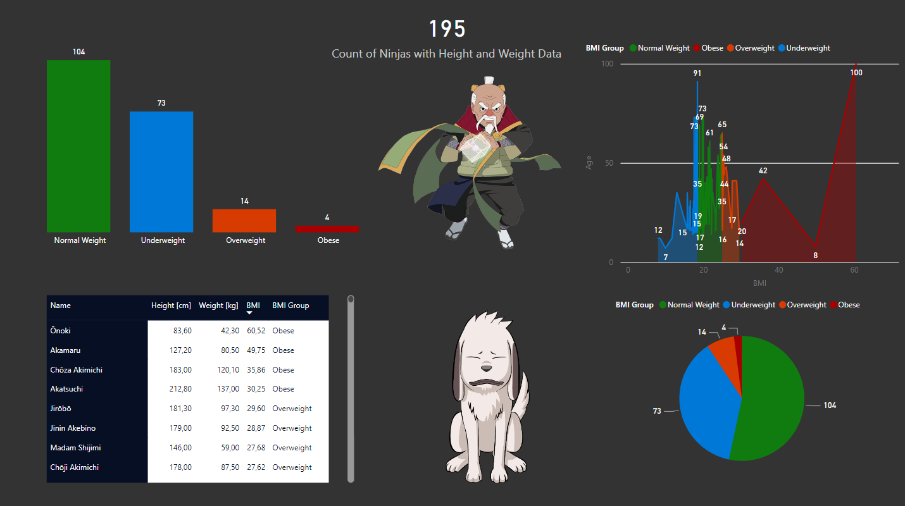

## Naruto Anime - Web Scraping, Data Cleaning and Visualization
In this project: 
- I used **Python (BeautifulSoup)** to webscrape fandom Naruto wiki and get characters data.
- I cleaned the data with **pandas** library and prepared it for export to **Power BI Desktop**
- I reformed one big table to smaller ones and connected them using primary and foreign keys.
- Lastly, I generated visuals to answer the questions.

## Questions to answer:

### 1. What are the biggest clans? 

Biggest clan is the Uchiha, but sadly most of them are dead...
Hyūga clan is 2nd biggest and it is true that it is one of the biggest Konoha's clan in Naruto anime.
### 2. What is nature type ninjas distribution among all clans? 

When you click hamburger menu, slicer with clan chooser shows up.

### 3. Are ninjas fit? 
I categorized ninjas into weight groups.

This chart has drill down option (51-60 kg below).

There are no female ninjas above 60 kg's but overall even males seem to have low weight.
Ninjas are known to be light and fast. (I think I might create a BMI rating for this)

### 3.1 BMI rating
I calculated BMI rating using European standard measures mass (kg) divided by square of height (m).

It turned out that Ōnoki is a victim of obesity :O
#### WHY?
He is lower than 1 m and our calculation method is supposed to increase height value by squaring it. 
If our height is below 1 then we have an issue (e.g. 0.9*0.9 < 0.9)

#### Second most obese in Naruto
is Akamaru - character that is a fighting dog. Our wiki does not provide any length, that's why I left it, but it is obviously a mistake.

### 4. What are most common jutsus and tools? 
Coming soon...

## *Data Structure changes
I started with one big table containing a lot of unleaned data.

I performed data cleaning and modeling with creation of new smaller tables basing on 
<ins>one to one</ins>, <ins> many to one </ins> or <ins>many to many</ins> relations.

------------------------------------------------
### TODO:
- [x] Integrate dictionary values
- [x] Integrate dictionary keys
- [x] Generate a pandas dataframe object
- [x] Perform data cleansing
- [x] Include next page links in the code
- [x] Develop visually appealing displays
- [x] Create additional columns
- [x] Generate separate tables for data containing commas

### Pending Tasks:
- [ ] Develop more visually appealing displays
- [ ] BMI ratio for Q3
