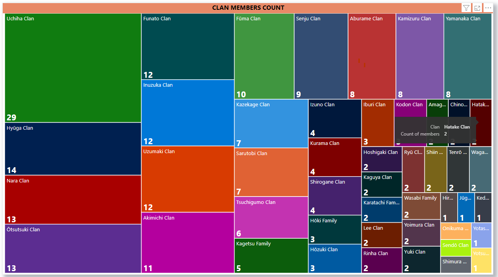
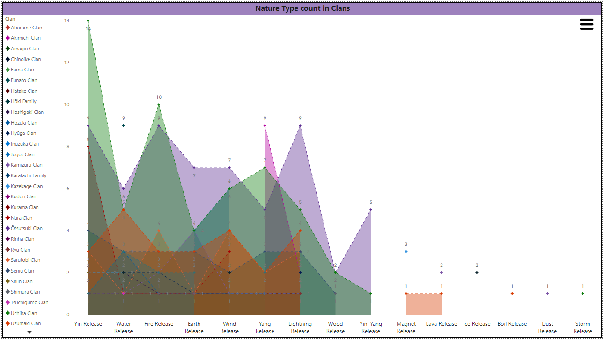
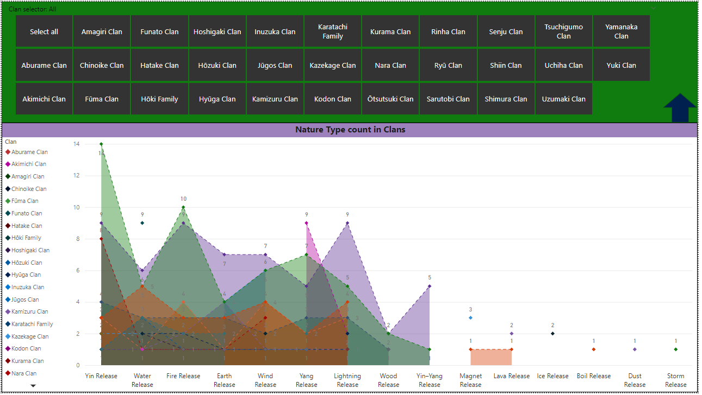
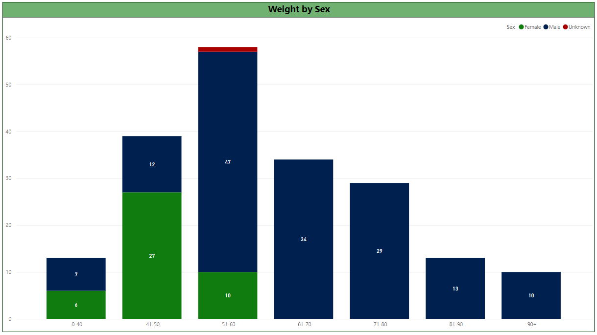
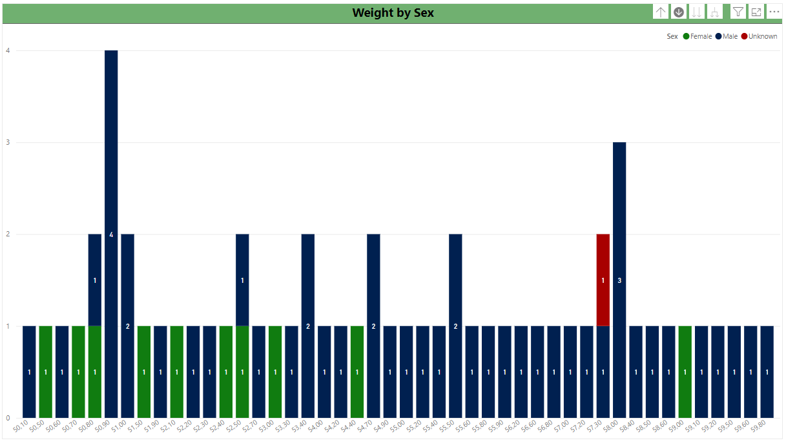
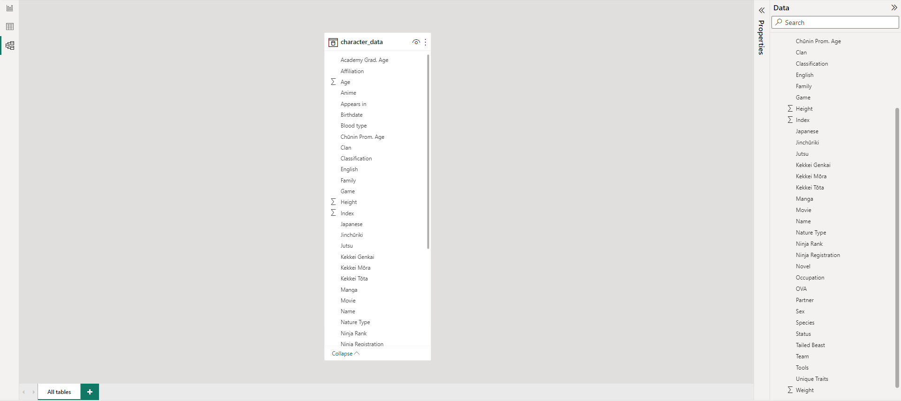
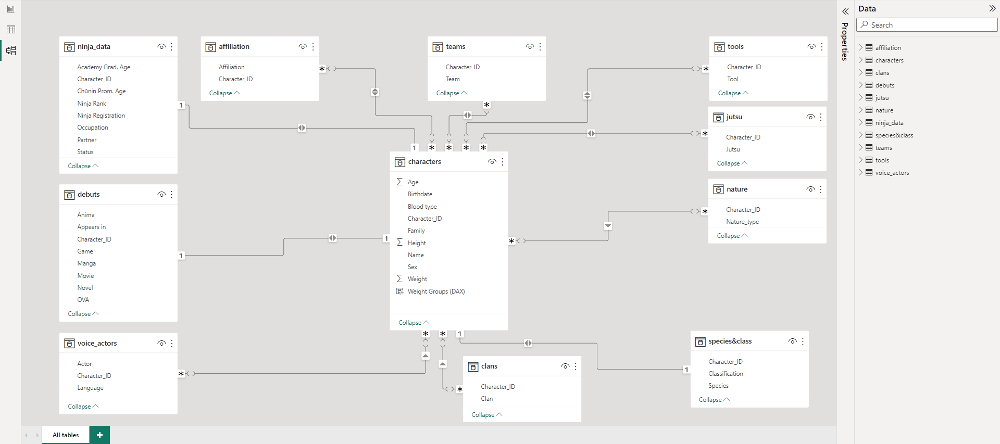

## Naruto Wiki Analysis: Unveiling the Shinobi Secrets
#### In this project: 
- Utilized **Python (BeautifulSoup)** library to scrape data from the fandom Naruto wiki, extracting character information.
- I cleaned the data with **pandas** library ensuring the data was structured appropriately for analysis.
- Prepared the cleaned data for export into Power BI Desktop, a powerful data visualization tool.
- Transformed the data by splitting one large table into smaller ones and establishing relationships between them using primary and foreign keys.
- Leveraged Power BI Desktop to create insightful visuals that provide answers to specific questions regarding the Naruto dataset.
<br/><br/>
Overall, this project involved web scraping, data cleaning, data modeling, and visualization to gain valuable insights into the Naruto characters' data.
### I. Web Scraping:
In this section, we'll walk through the process of scraping character data from a website and saving it to a CSV file.

```python
# Function to scrape character data from a given URL
def scrape_character_data(url):
    response = requests.get(url)

    # Send a request to the URL and create a BeautifulSoup object
    response = requests.get(url)
    soup = BeautifulSoup(response.content, "html.parser")
    character_links = soup.find_all("a", class_="category-page__member-link")
    character_data = []

    for link in character_links:
        character_name = link.text.strip()
        character_url = urljoin(base_url, link["href"])

        # Send a request to the character URL and create a BeautifulSoup object
        character_response = requests.get(character_url)
        character_soup = BeautifulSoup(character_response.content, "html.parser")
        infobox_table = character_soup.find("table", class_="infobox")

        if infobox_table:
            # Extract data from the table
            table_data = {'Name': [character_name]}

            headers = [header.get_text(strip=True) for header in infobox_table.find_all('th')
                       if 'mainheader' not in header.get('class', [])]
            headers[0] = 'Name'

            rows = infobox_table.find_all("tr")

            for row in rows[1:]:
                header = row.find("th")
                if header:
                    key = header.text.strip()
                    value_element = row.find("td")

                    if value_element:
                        for span in value_element.find_all("span", class_="smwttcontent"):
                            span.extract()

                        value = value_element.text.strip()
                        if key not in table_data:
                            table_data[key] = []
                        table_data[key].append(value)

            character_data.append({"Name": character_name, **table_data})

    return character_data


# Initialize a list to store all character data
all_character_data = []

# Scrape character data from multiple pages until there are no more next pages
while url:
    character_data = scrape_character_data(url)
    all_character_data.extend(character_data)

    soup = BeautifulSoup(requests.get(url).content, "html.parser")
    next_link = soup.find("a", class_="category-page__pagination-next")
    if next_link:
        url = urljoin(base_url, next_link["href"])
    else:
        url = None

# Create a DataFrame from the scraped character data
df = pd.DataFrame(all_character_data)

# Save the DataFrame to a CSV file
df.to_csv("csv's/character_data3.csv", index=False, encoding='utf-8-sig')
```
### II. Data Cleaning:
In this section, we'll walk through the data cleaning steps performed on the character data.
```python
import pandas as pd

# Read the CSV file (created during the web scraping part)
df = pd.read_csv("csv's/character_data3.csv")

# Remove unwanted characters and whitespace
df = df.apply(lambda x: x.str.replace(r"\[|\]|'", ""))
df = df.apply(lambda x: x.str.replace(r'\\n', ', ', regex=True))
df = df.apply(lambda x: x.str.replace(r'"', '', regex=True))
df = df.applymap(lambda x: ' '.join(x.split()) if isinstance(x, str) else x)

# Set unknown values for 'Sex' column
df.loc[~df['Sex'].isin(['Male', 'Female']), 'Sex'] = 'Unknown'

# Extract numeric values for 'Height', 'Weight', and 'Age'
# Note: Age, Height, and Weight values were collected from different series (Naruto|Naruto Shippuden|Boruto).
# We have considered the most recent occurrence for each character.

df['Height'] = df['Height'].str.extract(r'(\d+(?:\.\d+)?) cm$')
df['Weight'] = df['Weight'].str.extract(r'(\d+(?:\.\d+)?) kg$')
df['Age'] = df['Age'].str.extract(r'(\d+)$')

# Removing specific and unwanted prefixes
df['Family'] = df['Family'].str.replace(r'^Family, \\t, ', '', regex=True)
df['Nature Type'] = df['Nature Type'].str.replace('Nature Type, , ', '', regex=True)
df['Jutsu'] = df['Jutsu'].str.replace('Jutsu, , , ', '', regex=True)
df['Jutsu'] = df['Jutsu'].str.replace(', , , ', ', ', regex=True)
df['Tools'] = df['Tools'].str.replace('Tools, , , ', '', regex=True)
df['Tools'] = df['Tools'].str.replace(', , , ', ', ', regex=True)
df['Unique Traits'] = df['Unique Traits'].str.replace(r'^Unique Traits, \\t, ', '', regex=True)

# Export to CSV file
df.to_csv("csv's/character_data4.csv", index=False, encoding='utf-8-sig')
```
### III. Visualization - Questions and Findings:
Questions to answer:

### III.1 What are the biggest clans? 
To identify the largest clans in the Naruto universe, I analyzed the data and generated the following chart:

The Uchiha clan emerged as the largest, although it is unfortunate that many of its members have met an untimely fate. <br/><br/>
The Hyūga clan ranked second, aligning with its reputation as one of the prominent clans within Konoha in the Naruto anime.
### III.2 What is nature type ninjas distribution among all clans? 
To understand the distribution of nature types among different clans, I created the following visualization:

By clicking the hamburger menu, a slicer appears, enabling you to choose specific clans and explore the corresponding nature types:


### III.3 Are ninjas fit? 
I analyzed the weight distribution among ninjas and categorized them into different weight groups. 
<br/><br/>The following chart showcases the weight distribution:

The chart includes a drill-down option, allowing a closer look at the weight range of 51-60 kg:

Interestingly, there are no female ninjas above 60 kg, and overall, even male ninjas tend to have relatively low weight. 
<br/><br/>
This aligns with the notion that ninjas are known for their agility and speed, emphasizing the importance of being lightweight.

### III.3b BMI Ratings: Assessing Ninja Health
To further assess the health of the ninjas, I calculated their BMI ratings using the European standard. <br/>
BMI was calculated by dividing the mass (kg) by the square of height (m). <br/><br/>
The following chart displays the BMI ratings:

However, it is important to note that certain anomalies were observed in the BMI calculations. <br/><br/>
<br/>
For instance, Ōnoki's height is lower than 1m, resulting in an issue with the calculation method. <br/>
<br/>
Additionally, Akamaru, a character classified as a fighting dog, lacks length information, which prevents an accurate BMI assessment.
#### CONCLUSION
Based on the available data, only 4 ninjas appear to be classified as obese, although 2 of them have been eliminated due to calculation issues. This leaves 2 remaining obese ninjas.
<br/><br/>
Moreover, 14 ninjas are classified as overweight, indicating a higher percentage of weight-related concerns.
<br/><br/>
However, it is worth considering that out of the 195 ninjas with available height and weight data, only 16 fall into the overweight or obese categories, which accounts for less than 10% of the dataset.
<br/><br/>
The majority of the ninjas exhibit a healthy BMI ratio, with 104 out of 195 falling within the normal range.
<br/><br/>
Nevertheless, it is intriguing to note that 37.44% of the ninjas are classified as underweight, which may initially raise concerns. 
#### BUT!
It is important to remember that ninjas undergo rigorous training to improve their taijutsu and ninjutsu skills, making physical training a core aspect of their lives.
<br/><br/>
Moreover, considering the context of the Naruto universe within Japanese culture, it is worth noting that Japanese people are known for their consumption of raw food, which contributes to longevity and overall health, even with lower body weight.

### III.4 What is the relationship between a character's rank and their Jutsu/Tools?
Analyzing the correlation between a character's rank (e.g., Kage, Chunin, Jonin) and their abilities can reveal any trends or patterns. We will explore if higher-ranked characters tend to possess stronger abilities.

### IV. Data Structure changes
<p> Initially, the project involved working with a single large table containing uncleaned data.<br/><br/> 
To improve the data structure, I performed data cleaning and modeling, resulting in the creation of smaller tables based on one-to-one, many-to-one, or many-to-many relationships. <br/><br/>
The transformation is depicted below:</p>



These changes aimed to enhance data organization and facilitate more efficient analysis and visualization.
------------------------------------------------
### TODO:
- [x] Integrate dictionary values
- [x] Integrate dictionary keys
- [x] Generate a pandas dataframe object
- [x] Perform data cleansing
- [x] Include next page links in the code
- [x] Develop visually appealing displays
- [x] Develop more visually appealing displays
- [x] Create additional columns
- [x] Generate separate tables for data containing commas
- [x] BMI ratio (III.3.1.)
- [x] Paste code snippets (points I. and II.)

### Pending Tasks:
- [ ] Develop EVEN more visually appealing displays!
- [ ] Jutsu and Tools all charts
